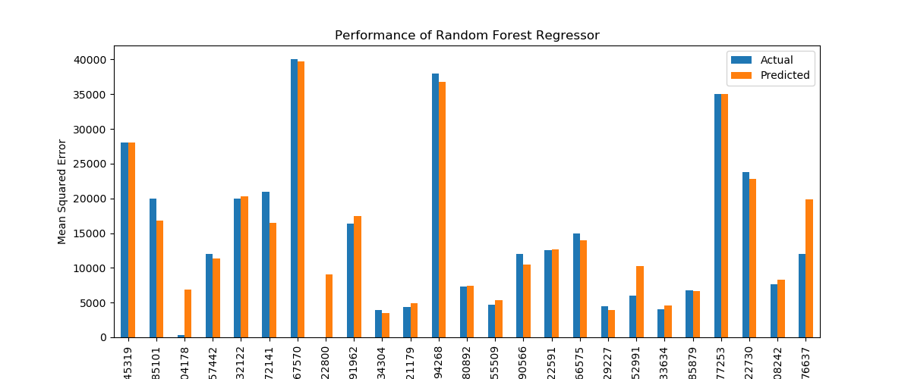

# What drives the price of a car?

This data study examines a vehicle dataset and derives the factors that influence the price of a car and provide recommendations to used car dealership.

## Description
From a business perspective, the goal of this data task is to identify the key factors that influence used car prices to make more accurate pricing predictions. This information can be used by businesses to make better decisions about pricing their own used cars, as well as to understand the factors that are driving the overall market for used cars.

## Getting Started :
To get started with this project, we need to have the following dependecies :
* Python 3.6+
* Jupyter Notebook
* Vehicle Dataset
* Python libraries such as NumPy,Pandas,Scikit-learn,matplotlib, seaborn.

### Data Understanding :

###### Taking following steps to understand the data :

Explore the data: Overview of the data, such as the number of records, the number of columns, and the data types of each column and would also look for any patterns or trends in the data.

###### Data Quality Issues :

* Identify any missing values in the data.
* Identify any duplicate records in the data.
* Identify any outliers in the data and investigate them.
* Check for any inconsistencies in data type and format of the data.

##### Data Preparation :
After our initial exploration and fine tuning of the business understanding, it is time to construct our final dataset prior to modeling. Here, we want to make sure to handle any integrity issues and cleaning, the engineering of new features, any transformations that we believe should happen (scaling, logarithms, normalization, etc.), and general preparation for modeling with sklearn.

###### Data Cleaning :
As part of data cleaning, the following activities have been carried out:

* Dropping unwanted columns such as id, VIN, size and state from the dataset and extracted important features.
* Dropping missing values for year, transmission, fuel, odometer, model
* Filling missing values for other categorical features with 'unknown'
* Removing Duplicate Values
* Handling categorical values by mapping values outside certain range into 'others' 
* Removing outliers for based on IQR for price and odometer

###### Data Encoding:
The following encoding techniques were applied to the categorical variables:

* Ordinal Encoding
* One-Hot Encoding

### Data Visualization :

###### Visualizing data correlation using heatmap.

we can see that year and price have positive correlation while odometer and price have negative correlation.

###### Plotting Manufacturer vs Price Distribution.

###### Visualizing box plot distribution of Condition vs Price.

###### Plotting Fuel vs Price Distribution.

###### Plotting Model vs Price Distribution.

### Modeling :

###### Prepare Datasets for Model :

Creating column transformer with OneHotEncoder and OrdinalEncoder for categorical features.
Creating train and test datasets.
Creating function for cross validation/process the result of the model.
Creating dataframe that store the performance of each model for the final review and selection.

`Linear Regression Model` - Create linear regression rodel with column transformer, resulted in MSE of 92758679.05 and accuracy of 46.3%
`LinearRegression With PolynomialFeatures` - Create model with polynomial features degree and identifing best degree polynomial model. Run the model with best complexity, resulted in MSE of  86144810.33 and accuracy of 50.13%
`Ridge Regression Model` - Create ridge pipeline by applying StandardSclaer and column transformer and perform GridSearchCV to generate model with best hyperparameter, resulted in MSE of 92698510.24 and accuracy of  46.34%
`Lasso Regression Model` - Create pipeline by applying StandardSclaer and column transformer and lasso model with hyperparameter alpha, resulted in MSE of 92700760.72 and accuracy of 46.34%
`Linear Regressor with Sequential Feature Selection` - Create linear regression model with polynomial features column transformer with sequential feature selector, resulted in MSE of 101542236.54 and accuracy 41.22%
`Lasso as FeatureSelector` - Create linear regression model with polynomial features column transformer, standard scaler and lasso as feature selector, MSE of 86145045.21 and accuracy 50.13%
`Random Forest Regressor`- Create Random Forest Regressor with n estimators, resulted in MSE of 34868501.26 and accuracy of 79.82%.

### Evaluation:

Now that we have built some models, we can compare and verify the performance of each model, result of cross validation for each model is added into score_data for the final review.

As a part of cross validation, each model is evaluated using various metrics such as R2 score, Accuracy in percentage, Mean Squared Error (MSE), Mean Absolute Error (MAE), Root Mean Squared Error (RMSE). We can generate basic report of all models and effectiveness and share with client (car dealer) to fine tune their invetory and pricing.

##### Summary of Model Evaluations :

Performance of Linear regressor, Ridge regressor and Lasso regressor was average with Accuracy ~46% and yielding high Mean Squared Error.

Polynomial Linear regressor and Linear regressor with Lasso feature selector performed better than other models with Accuracy ~50% and MSE of 86144810.33 and 86145045.21 respectively.

Random forest regressor model performed best out of all models with Accuracy 79.8% and lower MSE of 34868501.26

###### Performance Analysis of Best Model Random Forest Regressor :

## Next Steps and Recommendations

#### Feature Exploration: 
Continue exploring and engineering features that could improve model performance.

#### Hyperparameter Refinement: 
Refine hyperparameters while validating against unseen data for optimal generalization.

#### Domain Expertise: 
Use domain knowledge to improve the feature selection and to interpret model results.

#### Residual Analysis: 
Analyze residuals to uncover underlying trends or patterns that models may not capture accurately and any overfitting or underfitting.

# Link to notebook :

https://github.com/ashwinisanagoudar/MLApp-UsedCarPricing/blob/main/prompt_II.ipynb

